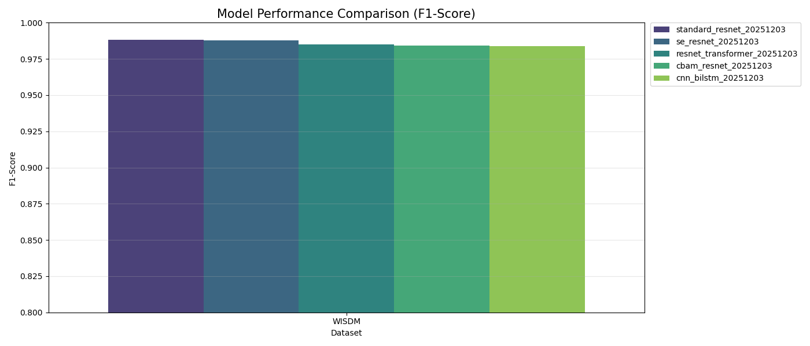

# 📝 2025-12-03 실험 노트: WISDM 데이터셋

### 1. 실험 내용
- **데이터셋**: WISDM 
- **비교 모델 (5종)**:
  1. Standard ResNet
  2. SE-ResNet
  3. CBAM-ResNet
  4. ResNet-Transformer
  5. CNN-BiLSTM

### 2. 실험 결과

* **1등**: **Standard ResNet** (가장 단순한 모델)
* 5개 모델 모두 F1-Score **0.98** 대로 성능은 거의 비슷함.
* 오히려 구조가 복잡한 모델들이 미세하게 점수가 낮은 경향을 보임.

### 3. 분석 및 생각 (Why?)
가장 단순한 모델이 1등을 한 이유는 **데이터의 특성** 때문인 것 같다.

1. **패턴의 단순성**: WISDM은 걷기, 조깅 같은 단순 반복 동작 위주라 패턴이 명확.
2. **충분한 깊이**: Standard ResNet만으로도 현재 조건에서는 충분히 좋은 성능을 보이는 듯.
3. **채널 부족**: 입력 채널이 딱 3개(x, y, z)뿐이라 SE(Channel Attention)나 Transformer가 힘을 쓸 여지가 적음.

> **가설**: 센서(채널) 수가 많은 데이터셋(PAMAP2, Opportunity)이라면 복잡한 모델의 성능 우위가 나타날 가능성이 있음.

### 4. 오늘의 결론
> **"센서 수가 적고 패턴이 명확한 경우, 복잡한 모델의 추가 이득이 작을 수 있다."**  
> (오히려 오버스펙 모델은 성능이 안 나오거나 비효율적일 수 있음)

---

### 추가 개선 및 수정할 부분
- 현재는 **슬라이딩 윈도우(Overlap 50%) + train_test_split(random_state=42)** 사용  
  → **Subject-wise Split**로 변경할 필요 있음.
- 실험 재현성 확보 위해 **여러 시드로 반복 수행 후 평균·표준편차 계산** 
  → Colab 환경에서 학습 시간 제한 고려 필요.
- **스케일링 누락 → 수정 필요** 
- Transformer 기반 모델에 **포지셔널 임베딩 미적용 → 추가 예정**
